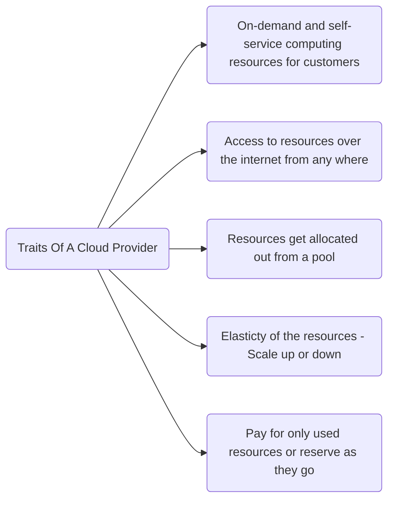
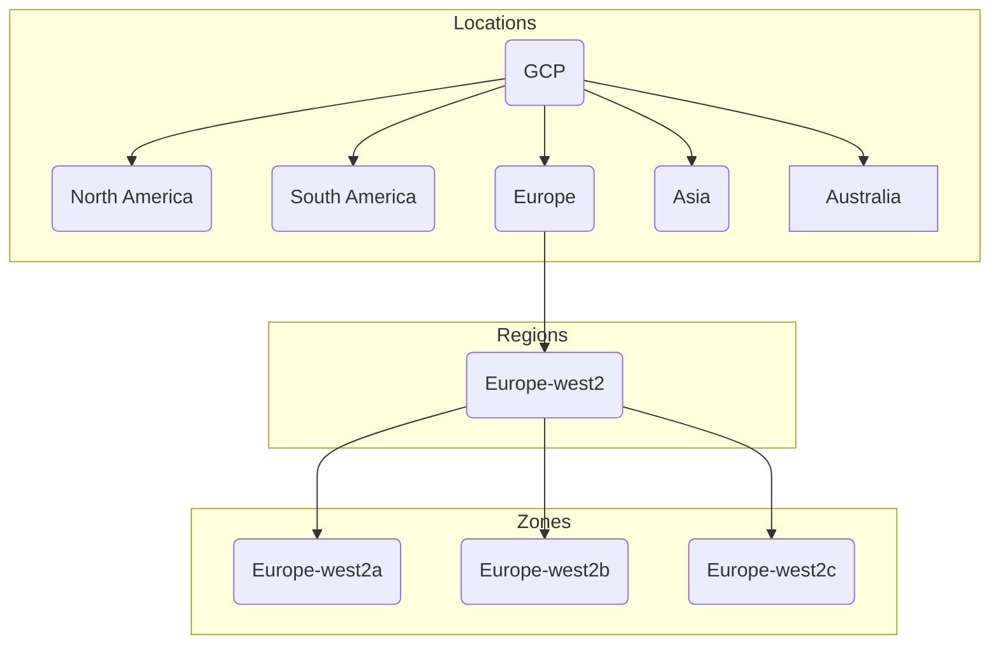

# GCP
## Traits Of A Cloud

### Data Center Hierarchy

Any application can be deployed across multiple zones for app redundacy. Some of the services can also be deployed across different regions so that app can be 
accessible even when the one of the region is down.
