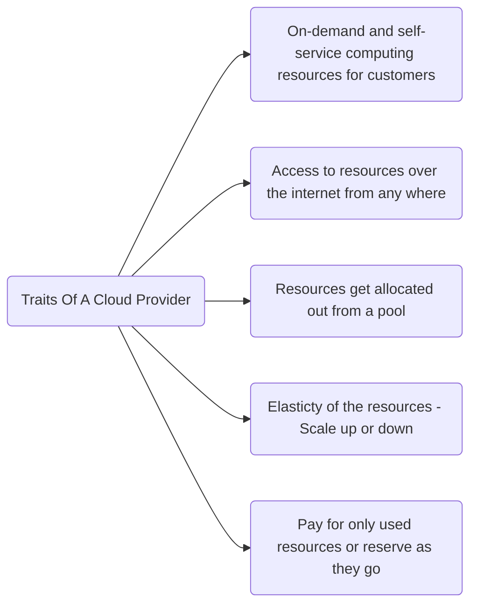
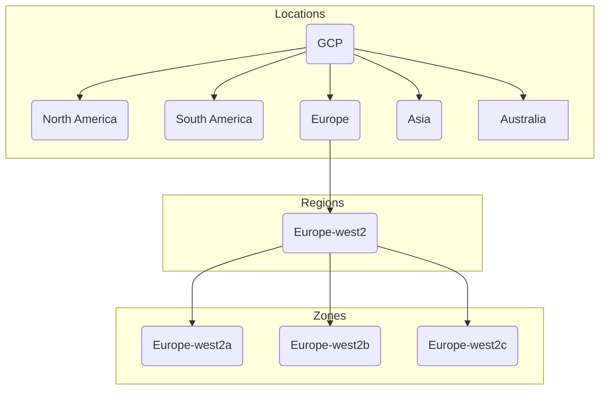

# GCP
## Traits Of A Cloud

### Data Center Hierarchy

Any application can be deployed across multiple zones for app redundacy. Some of the services can also be deployed across different regions so that app can be 
accessible even when the one of the region is down.
<blockquote>
    GCP has around 103 zones and 34 regions. We can find the upto date info on locations at <a href="cloud.google.com/about/locations">cloud.google.com/about/locations</a> 
</blockquote>

### Dates
ES supports three formats
1. date without time
2. date with time
3. milliseconds since the epoch(long)

By default UTC timezone is assumed and date must be formatted according to ISO 8601 spec

