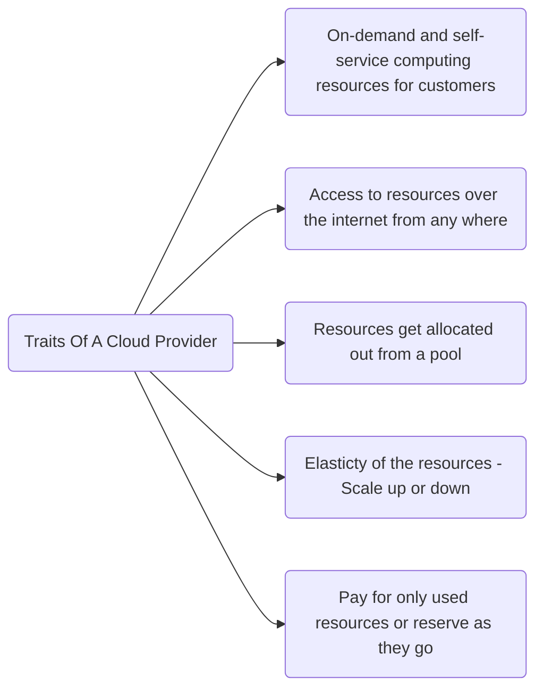
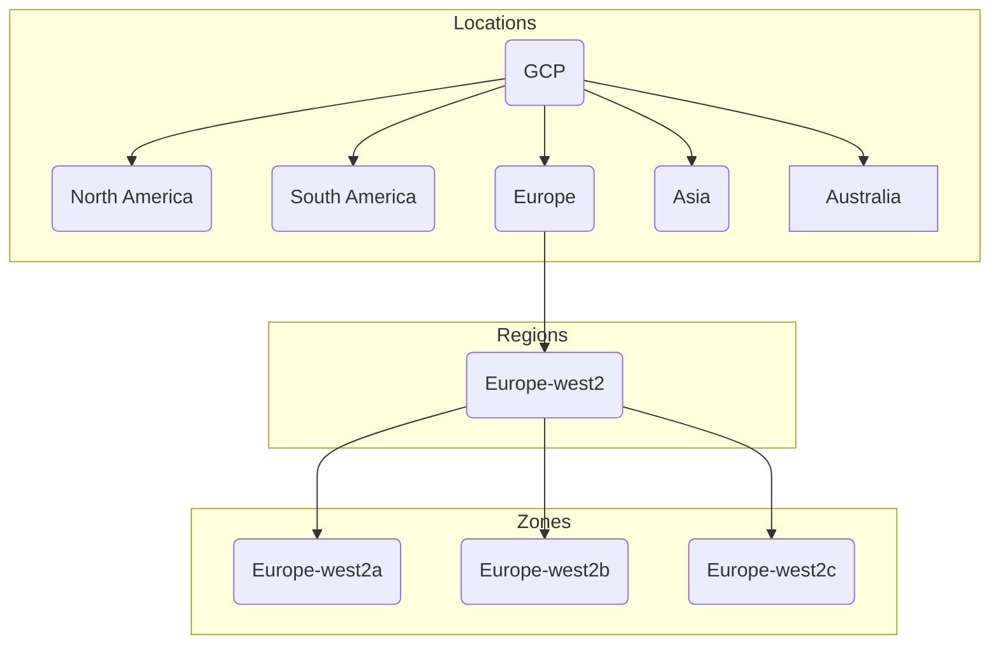

# GCP
## Traits Of A Cloud

### Data Center Hierarchy

Any application can be deployed across multiple zones for app redundacy. Some of the services can also be deployed across different regions so that app can be 
accessible even when the one of the region is down.
<blockquote>
    GCP has around 103 zones and 34 regions. We can find the upto date info on locations at <a href="cloud.google.com/about/locations">cloud.google.com/about/locations</a> 
</blockquote>

### Dates
ES supports three formats
1. date without time
2. date with time
3. milliseconds since the epoch(long)

By default UTC timezone is assumed and date must be formatted according to ISO 8601 spec

### Security For Customer Data
Google provides layered security for the data centers.
#### Hardware Infrastructure Layer
- Hardware(Boards, networking equipment, Hardware security chip) is custom designed by Google.
- Secure boot stack: Checking cryptographic signatures of files, kernels and other softwares to ensure the server is booting the secure software
- Premises security

#### Service Deployment Layer
- Encryption of inter-service communication using RPC with Harware accelerated encryption

#### User Identity Layer
- Second factor auth

#### Storage Services Layer
 - Encryption at rest

#### Intercommunication Layer
- Google Front End(GFE)
- DDOS Protection

#### Operational Security Layer
- Intrusion detection
- Reducing insider risk
- Employee Universal Second factor auth
- Software development practices

<blockquote>Learn more at <a href="cloud.google.com/security/security-design">cloud.google.com/security/security-design</a></blockquote>

### Billing
Google provides usage per second billing.
<blockquote>Billing calculator can be found at <a href="cloud.google.com/proucts/calcuator">cloud.google.com/proucts/calcuator</a></blockquote>
We can set alters for billing when usage or budget reaches a certain limit. Also Google provides quotas to save owners from generating huge bills ecause of an attack or an error in the applcation. GCP provides two quotas.
- Rate Quota: For example pegging the number of API calls to a service upto a certain limit.
- Allocation Quota: Limiting the resource allocation to the application to a certain maximum limit. Ex: Allocate max of 8 GB Ram comsumption.

