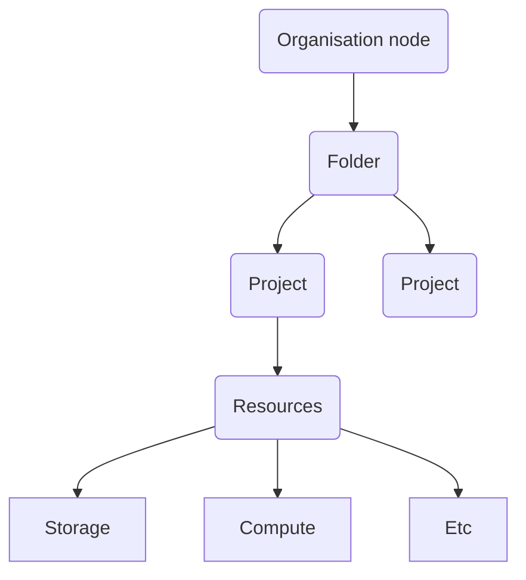

## Resource Hierarchy

```mermaid
graph TD;
    A(Organisation node) -->B(Folder);
    B -->C(Project);
    B-->D(Project);
    C-->E(Resources);
    E-->Storage;
    E-->Compute;
    E-->Etc;
```
Access policies can be applied to any level. i.e., project, resource, folder or organisation node.
