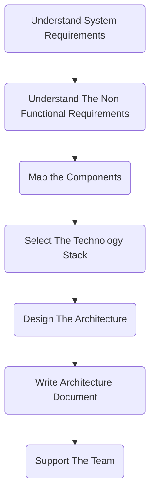

# Software Architecture
## Types of Architects
### Infrastructure Architect
Mainly handles architecting Servers, VMs, Storage etc. Familiar with requirements.
An infrastructure architect is responsible for designing and implementing complex computer systems that are used to manage and maintain large-scale software applications, databases, and other IT infrastructure components. They work closely with other IT professionals, such as software developers, network engineers, system administrators, and database administrators, to ensure that systems are secure, reliable, and scalable.

The specific responsibilities of an infrastructure architect can vary depending on the organization and the particular project they are working on, but some common duties include:
Evaluating and selecting hardware and software systems to support application development and delivery.
Developing and implementing IT infrastructure strategies that meet business requirements and support growth.
Designing and building secure and scalable network architectures, including firewalls, VPNs, and load balancers.
Creating disaster recovery and business continuity plans to ensure systems are available in the event of a disruption.
Defining and enforcing system standards and policies to maintain consistency across the organization.
Managing vendor relationships and negotiating contracts to ensure quality service delivery and cost savings.
Staying up to date with the latest technologies and trends in the IT industry to inform system design decisions and drive innovation.
Overall, infrastructure architects play a critical role in ensuring that an organization's IT infrastructure is efficient, secure, and able to support its business goals.

### Enterprise Architect
Operates at a very high level with CXOs. No relation to actual development.
Enterprise architects are responsible for designing and maintaining the overall enterprise architecture of an organization. This includes defining the technical strategy, standards, and guidelines that govern the development and deployment of all IT systems and services within the organization.

Enterprise architects work closely with business leaders and stakeholders to ensure that the organization's IT infrastructure and systems align with business goals and objectives. They also identify opportunities for process improvement and innovation, and work with development teams to design and implement new solutions that meet business needs.
In addition to technical expertise, enterprise architects must have strong leadership and communication skills, as they often lead cross-functional teams and must be able to communicate complex technical concepts to both technical and non-technical stakeholders. They must also stay up-to-date with emerging technologies and industry trends, and be able to assess the potential impact of these developments on the organization's IT strategy and architecture.
### Software Architect (System/Application Architect)

Sure, let's consider a SaaS company that provides a cloud-based project management software.

The enterprise architect would be responsible for understanding the company's overall business strategy and objectives, and aligning the technology strategy with it. They would be involved in making decisions about which technologies to use, how to architect the system to meet the company's needs, and ensuring that the overall system is scalable, reliable, and secure. They would also be involved in ensuring that the architecture is flexible enough to accommodate future changes and developments.

The infrastructure architect would be responsible for designing and maintaining the infrastructure that supports the SaaS application. This would include the servers, storage, network, and other components that are necessary to deliver the service. They would ensure that the infrastructure is reliable, scalable, and secure, and that it can handle the traffic and usage patterns of the application. They would also be responsible for ensuring that the infrastructure is cost-effective and that it can be managed and maintained efficiently.

The software architect would be responsible for designing the software application itself. They would work closely with the product management team to understand the requirements of the software, and would be responsible for designing the overall architecture of the software. This would include decisions about the programming languages and frameworks to use, the overall design of the software, and how different components of the software interact with each other. They would also be responsible for ensuring that the software is testable, maintainable, and scalable, and that it can be developed efficiently by the development team.

Overall, these three types of architects work together to ensure that the SaaS application is well-designed, well-implemented, and well-supported. They help to ensure that the application is reliable, scalable, and secure, and that it can meet the needs of the company's customers.

### Baseline Requirements Of Any Project
- Fast
- Secure
- Reliable
- Easy to maintain

Architect designs a system keeping these requirements in mind using optimal tech stack and methods.

## The Architecture Process

- Requirements = What System Should Do, Defined by system analyst
- Non functional Requirements = No of users, loads,volumes, performance impact
- Mapping the components = Tasks of the system
- Selection of technology stack = 
- Designing the Architecture
- Writing the Architecture Document = Describes the architecture and process, must be relavant to all parties.
- Support the team
