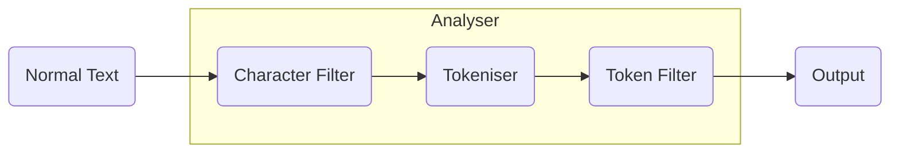

Also known as `Text Analysis`. 

When a text is indexed it will go through an analyser before getting indexed. The output from the analyser will be in a data structure
form that is suitable for searching.

- **Character Filter:** Removes these some special or specified characters. Minimum one character filter. There can be multiple of these. These will be
executed in the order they are specified. Ex: Hey! How are you? ---> Hey How are you
- **Tokensier**: Spilts text into tokens based on certain technical aspects of the character encoding. Ex: Hey How are you ---> [Hey,How,are,you]
- **Token Filter:** Filters the input from tokeniser. A token filter is not mandatory. Multiple can be specified. 
Ex: A lowercase filter: [Hey,How,are,you] ---> [hey,how,are,you]
We can create custom analysers by using different combinations of the above three.

### Anlyser API:
We can use this API to debug the analyser before using it on the documents.
```bash
# Specifying the analyser directly
POST _analyze
{
  "text": ["Hey!!!!!! Happy new year! Welcome To 2023  "],
  "analyzer": "standard" 
}
# Specifying different parts of the analyser separately
POST _analyze
{
  "text": ["Hey!!!!!! Happy new year! Welcome To 2023  "],
  "char_filter": [],
  "tokenizer": "standard",
  "filter": ["lowercase"]
}
```

#### Output:
```json
{
  "tokens": [
    {
      "token": "hey",
      "start_offset": 0,
      "end_offset": 3,
      "type": "<ALPHANUM>",
      "position": 0
    },
    {
      "token": "happy",
      "start_offset": 10,
      "end_offset": 15,
      "type": "<ALPHANUM>",
      "position": 1
    },
    {
      "token": "new",
      "start_offset": 16,
      "end_offset": 19,
      "type": "<ALPHANUM>",
      "position": 2
    },
    {
      "token": "year",
      "start_offset": 20,
      "end_offset": 24,
      "type": "<ALPHANUM>",
      "position": 3
    },
    {
      "token": "welcome",
      "start_offset": 26,
      "end_offset": 33,
      "type": "<ALPHANUM>",
      "position": 4
    },
    {
      "token": "to",
      "start_offset": 34,
      "end_offset": 36,
      "type": "<ALPHANUM>",
      "position": 5
    },
    {
      "token": "2023",
      "start_offset": 37,
      "end_offset": 41,
      "type": "<NUM>",
      "position": 6
    }
  ]
}
```
