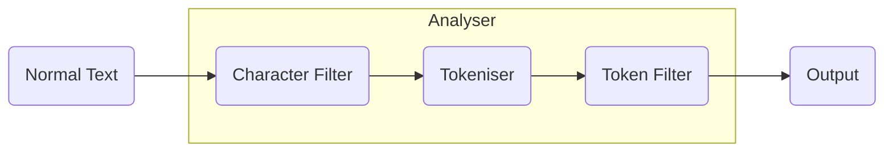

Also known as `Text Analysis`. 

When a text is indexed it will go through an analyser before getting indexed. The output from the analyser will be in a data structure
form that is suitable for searching.

- **Character Filter:** Removes these some special or specified characters. Minimum one character filter. There can be multiple of these. These will be
executed in the order they are specified. Ex: Hey! How are you? ---> Hey How are you
- **Tokensier**: Spilts text into tokens based on certain technical aspects of the character encoding. Ex: Hey How are you ---> [Hey,How,are,you]
- **Token Filter:** Filters the input from tokeniser. A token filter is not mandatory. Multiple can be specified. 
Ex: A lowercase filter: [Hey,How,are,you] ---> [hey,how,are,you]
We can create custom analysers by using different combinations of the above three.
