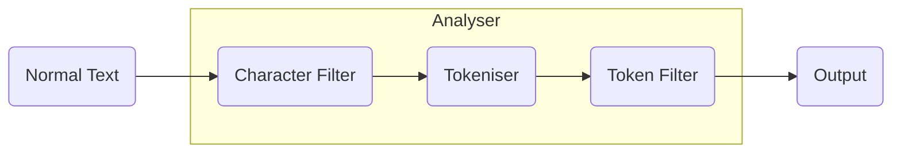

Also known as `Text Analysis`. 

When a text is indexed it will go through an analyser before getting indexed. The output from the analyser will be in a data structure
form that is suitable for searching.

- **Character Filter:** Removes these some special or specified characters. Minimum one character filter. There can be multiple of these. These will be
executed in the order they are specified. Ex: Hey! How are you? ---> Hey How are you
- **Tokensier**: Spilts text into tokens based on certain technical aspects of the character encoding. Ex: Hey How are you ---> [Hey,How,are,you]
- **Token Filter:** Filters the input from tokeniser. A token filter is not mandatory. Multiple can be specified. 
Ex: A lowercase filter: [Hey,How,are,you] ---> [hey,how,are,you]
We can create custom analysers by using different combinations of the above three.

### Anlyser API:
We can use this API to debug the analyser before using it on the documents.
```bash
# Specifying the analyser directly
POST _analyze
{
  "text": ["Hey!!!!!! Happy new year! Welcome To 2023  "],
  "analyzer": "standard" 
}
# Specifying different parts of the analyser separately
POST _analyze
{
  "text": ["Hey!!!!!! Happy new year! Welcome To 2023  "],
  "char_filter": [],
  "tokenizer": "standard",
  "filter": ["lowercase"]
}
```

#### Output:
```json
{
  "tokens": [
    {
      "token": "hey",
      "start_offset": 0,
      "end_offset": 3,
      "type": "<ALPHANUM>",
      "position": 0
    },
    {
      "token": "happy",
      "start_offset": 10,
      "end_offset": 15,
      "type": "<ALPHANUM>",
      "position": 1
    },
    {
      "token": "new",
      "start_offset": 16,
      "end_offset": 19,
      "type": "<ALPHANUM>",
      "position": 2
    },
    {
      "token": "year",
      "start_offset": 20,
      "end_offset": 24,
      "type": "<ALPHANUM>",
      "position": 3
    },
    {
      "token": "welcome",
      "start_offset": 26,
      "end_offset": 33,
      "type": "<ALPHANUM>",
      "position": 4
    },
    {
      "token": "to",
      "start_offset": 34,
      "end_offset": 36,
      "type": "<ALPHANUM>",
      "position": 5
    },
    {
      "token": "2023",
      "start_offset": 37,
      "end_offset": 41,
      "type": "<NUM>",
      "position": 6
    }
  ]
}
```
### Inverted Indices
These are maps with `Terms(Tokens in the context of Analyser)` as the keys and which documents that contain these terms as the field values. Every field in a document will have its own Inverted index. For example consider the following document
```json
{
  "_id":1  
  "title":"Greeting",
  "message":"Happy new year welcome to year 2023"
}
{
  "_id":3  
  "title":"Greeting",
  "message":"Happy Birthday"
}

{
  "_id":2  
  "title":"Reminder",
  "message":"Don't forget to wish on the last day"
}
```
We will have two separate inverted indexes one for each field `title` and `description`.
For ref.
#### title
| Term     | Document Id |
|----------|-------------|
| greeting | 1,2         |
| reminder | 2           |

#### description
| Term     | Document Id |
|----------|-------------|
| happy    | 1,3         |
| new      | 1           |
| year     | 1           |
| welcome  | 1           |
| to       | 1,2         |
| year     | 1           |
| 2023     | 1           |
| birthday | 3           |
| don't    | 2           |
| forget   | 2           |
| wish     | 2           |
| on       | 2           |
| the      | 2           |
| last     | 2           |
| day      | 2           |

Apart from document these inverted indices also contain other data like relavance score etc. Datatypes other than text are stored in other types of data structures.

### Mapping
Mapping is similar to defining the schema for a table in SQL. We define the field and the types of the document. Mapping can be explicit or dynamic or both combined.

### Data Types
[All Supported Data Types](https://www.elastic.co/guide/en/elasticsearch/reference/current/mapping-types.html)

#### Object
Every Json document is an Object. But objects are stored differently with ES as the underlysing Apache Lucene doesn't support nested objects. So elastic search will flatten the object.
Ex:
```json
{
    "name":"John Doe",
    "address":{
        "pincode":"530000",
        "door_no":"1-1-1",
        "city":"KPP"
    }
}
```
The above object will be stored as 
```json
{
    "name":"John Doe",
    "address.pincode":"530000",
    "address.door_no":"1-1-1",
    "address.city":"KPP"
}
```
#### Keyword
Where we will be looking for exact match. Used for filtering, sorting and aggregations. Ex: Published Status: PUBLISHED,DRAFT,SUSPENDED etc..

