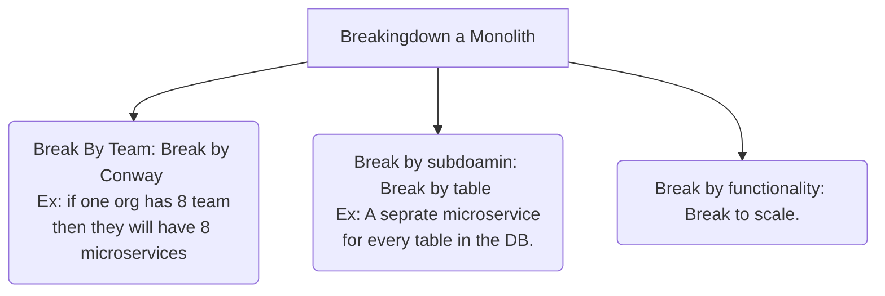

```mermaid
graph TD;
    A[Breakingdown a Monolith]-->B(Break By Team: Break by Conway \n Ex: if one org has 8 team then they will have 8 microservices);
    A-->C(Break by subdoamin: Break by table \n Ex: A seprate microservice for every table in the DB.);
    A-->D(Break by functionality: Break to scale.);
```
