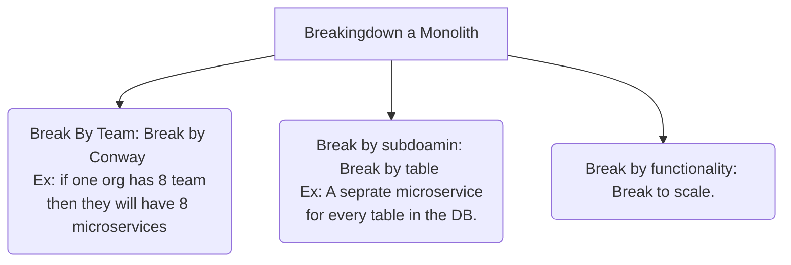

## Causes for Distributed Monolith:
- Incorrect division
- Too much business logic in shared library. Every time we need to release the latest version all the services which uses this library needs to be deployed. So having backward compatibility withing the library makes it optional to redeploy all the dependent sevices for the library.
- CI/CD Coupling.

## Scaled Independently

## Common Functionality
- Authentication/Authorization
- Configuration
- Monitoring
- Health Checks
- Common business logic(!)
## Whether to Extract Common Functionality Into Library or Microservice?
### Shared Library
 - Simple
 - Low performance impact
 - Cannot be polyglot
 - Increased coupling

### Separate Microservice
- Reduced coupling
- Support Polygllot development
- Impacts performance
- Increases complexity

### Hybrid Approach
- Reduced Shared business logic
- Let proxy handle - Network config, Distributed tracing, Auth, Security
- Using polyglot libraries where possible

## Ideal Environment for microservices
### Configuration
- Externalize all configuration to env vars, cmd line args, files(Yaml,toml etc..)
- feed configs from config maps
- seprate senstive config
- feed sensitive config from secrets
- Use the downward API
### Deployment
- Use helm for deploying the app
- Use the same Dockerfile for all environments
- Use the same Docker image for all environments

Docker Image Tips
- Build small tips (alpine,slim)
- Use a TCK-verified JVM image (Azul Zulu is good)
- Use **tini** to reap zombie processes
- Do not run as root
- Ex tools: Distroless

### Graceful Shutdown
- Ensure your app recives SIGTERM
- Catch SIGTERM
- Wait for all incoming connections to die
- Gracefully close all long-lived connections (DB connection pools)
- Exit app

