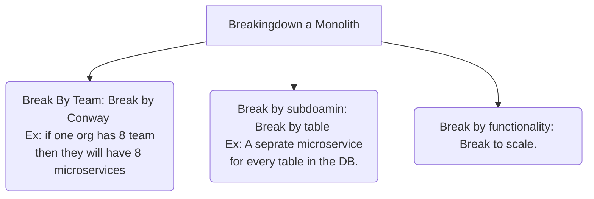

## Causes for Distributed Monolith:
- Incorrect division
- Too much business logic in shared library. Every time we need to release the latest version all the services which uses this library needs to be deployed. So having backward compatibility withing the library makes it optional to redeploy all the dependent sevices for the library.
- CI/CD Coupling.

## Scaled Independently

## Common Functionality
- Authentication/Authorization
- Configuration
- Monitoring
- Health Checks
- Common business logic(!)
